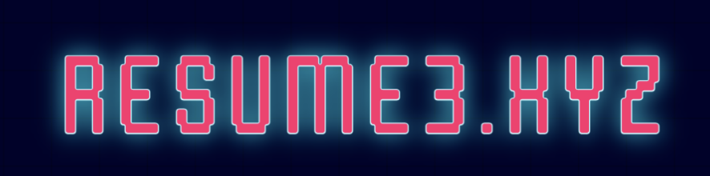

<div align="center">

  <h1>Resume3.xyz</h1>
  
  <p>
    Resumes re-imagined for web3 on-chain. 
  </p>

  
<!-- Badges -->
<p>
  <a href="https://github.com/Louis3797/awesome-readme-template/graphs/contributors">
    
  </a>
  <a href="">
    
  </a>
  <a href="https://github.com/Louis3797/awesome-readme-template/network/members">
    
  </a>
  <a href="https://github.com/Louis3797/awesome-readme-template/stargazers">
    
  </a>
  <a href="https://github.com/Louis3797/awesome-readme-template/issues/">
    
  </a>
  <a href="https://github.com/Louis3797/awesome-readme-template/blob/master/LICENSE">
    
  </a>
</p>
   
<h4>
    <a href="https://github.com/Louis3797/awesome-readme-template/">View Demo</a>
  <span> · </span>
    <a href="https://github.com/Louis3797/awesome-readme-template">Documentation</a>
  <span> · </span>
    <a href="https://github.com/Louis3797/awesome-readme-template/issues/">Report Bug</a>
  <span> · </span>
    <a href="https://github.com/Louis3797/awesome-readme-template/issues/">Request Feature</a>
  </h4>
</div>

<br />


<div align="center"> 
  
</div>
<!-- About the Project -->

## :star2: About the Project
Web3 is changing everything, so why would you want an outdated .pdf or word doc emailed to you only for you to leave in a pile on your desk? Wouldn't you want a quick and easy way to review an applicants skillset on chain, instantly.

<!-- Features -->
### :dart: Features

- Connect your web3 wallet. 
- Update your skills, experience, and additional resume info
- Deploy on chain to present to potential employers

<!-- Env Variables -->
### :key: Environment Variables

To run this project, you will need to add the following environment variables to your .env file

`INFURA_API_KEY`

`ETHERESCAN_API_KEY`

<!-- Getting Started -->
## 	:toolbox: Getting Started

<!-- Prerequisites -->
### :bangbang: Prerequisites

This project uses Yarn as package manager

```bash
 npm install --global yarn
```

<!-- Installation -->
### :gear: Installation

<!-- Run Locally -->
### :running: Run Locally

Clone the project

```bash
  git clone https://github.com/zkjet/resume3.xyz.git
```

Go to the project directory

```bash
  cd resume3.xyz
```

Install dependencies

```bash
  yarn install
```

Start the server

```bash
  yarn start
```

<!-- Contributing -->
## :wave: Contributing

<a href="https://github.com/Louis3797/awesome-readme-template/graphs/contributors">
  
</a>


Contributions are always welcome!

See `contributing.md` for ways to get started.

<!-- License -->
## :warning: License

Distributed under the MIT License. See LICENSE for more information.


<!-- Contact -->
## :handshake: Contact

[@zkjet](https://twitter.com/zkjet) - zkjet@mailfence.com

Project Link: [https://github.com/zkjet/resume.xyz](https://github.com/zkjet/resume.xyz)

<!-- Acknowledgments -->
## :gem: Acknowledgements

Use this section to mention useful resources and libraries that you have used in your projects.

 - [Shields.io](https://shields.io/)
 - [Awesome README](https://github.com/matiassingers/awesome-readme)
 - [Emoji Cheat Sheet](https://github.com/ikatyang/emoji-cheat-sheet/blob/master/README.md#travel--places)
 - [Readme Template](https://github.com/othneildrew/Best-README-Template)
